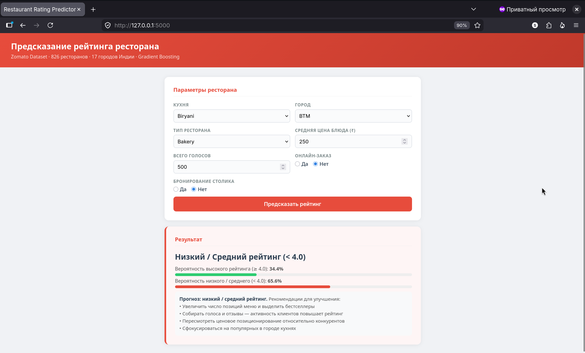
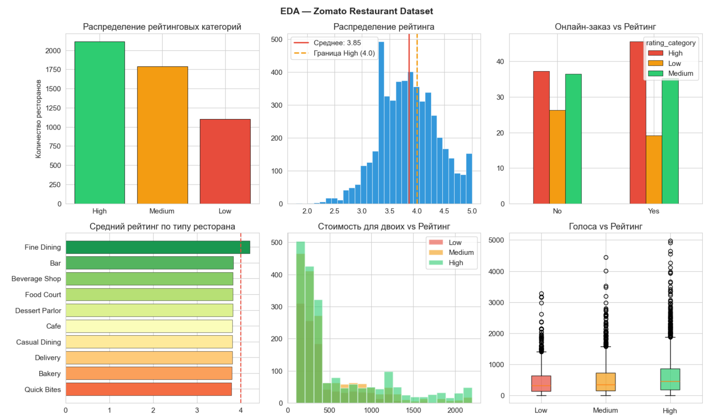
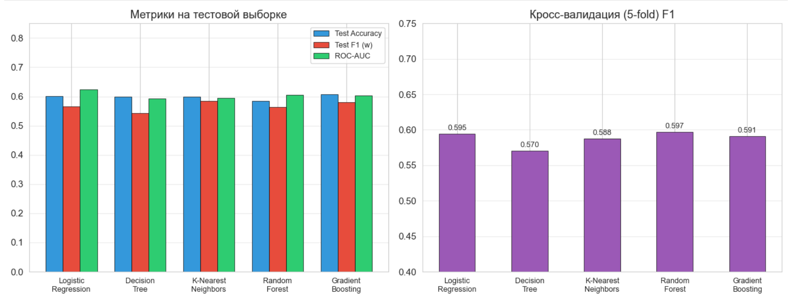
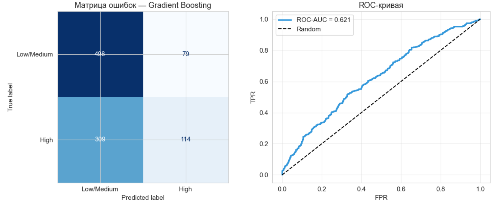
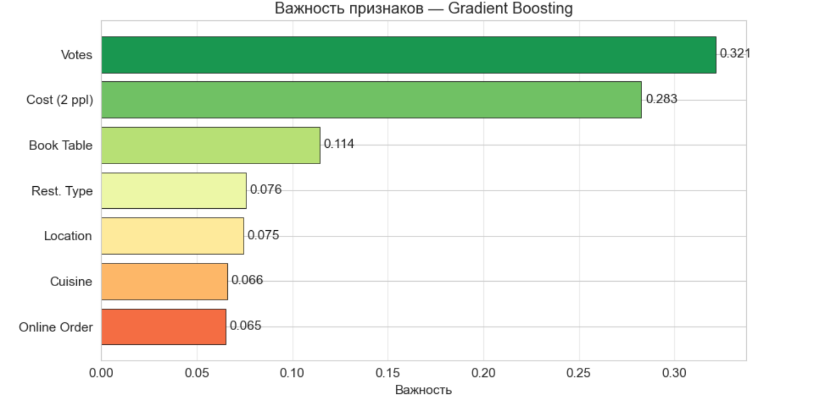

# Предсказание рейтинга ресторана (Zomato Dataset)

**Вариант 14:** Классификация рейтинга ресторана (≥ 4.0 как "Высокий")  
**Задача:** Предсказание вероятности получения высокого рейтинга по параметрам ресторана  
**Модель:** Gradient Boosting (ROC-AUC: 0.628, Accuracy: 0.607)

## Структура проекта

```
.
├── app.py                # Flask веб-приложение
├── notebook.ipynb        # EDA и обучение моделей
├── model.pkl             # Сохранённая модель
├── zomato_data.csv       # Данные для переобучения
├── requirements.txt      # Зависимости
└── README.md
```

## Быстрый старт

```bash
# Создание виртуального окружения
python3 -m venv venv
source venv/bin/activate  # Linux/Mac
# или: venv\Scripts\activate  # Windows

# Установка зависимостей
pip install -r requirements.txt

# Запуск приложения
python app.py
# Открыть http://localhost:5000
```

## Демонстрация



## Метрики данных и модели









## Параметры модели (7 признаков)

| Параметр | Описание | Тип |
|----------|---------|-----|
| `online_order` | Наличие онлайн-заказа | Binary (0/1) |
| `book_table` | Возможность бронирования столика | Binary (0/1) |
| `votes` | Количество оценок | Integer |
| `approx_cost` | Примерная стоимость на двоих (₹) | Float |
| `location` | Район/город | Category |
| `rest_type` | Тип ресторана | Category |
| `cuisines` | Кухня | Category |

## API

**Endpoint:** `POST /predict`

```bash
curl -X POST http://localhost:5000/predict \
  -H "Content-Type: application/json" \
  -d '{
    "online_order": 1,
    "book_table": 0,
    "votes": 500,
    "approx_cost": 250,
    "city": "Bangalore",
    "rest_type": "Cafe",
    "cuisine": "North Indian"
  }'
```

**Ответ:**
```json
{
  "label": "High",
  "prob_high": 0.7234,
  "prob_low": 0.2766,
  "tip": "Рекомендации для улучшения..."
}
```

## Переобучение модели

Если нужно переобучить модель на новых данных:

```bash
jupyter notebook notebook.ipynb
# Запустить все ячейки (Run All)
# Сохранить (Ctrl+S)
```

Модель будет пересохранена в `model.pkl`.

## Результаты

- **Лучшая модель:** Gradient Boosting
- **ROC-AUC:** 0.628
- **Accuracy:** 60.7%
- **F1 (weighted):** 0.580
- **Параметры:** n_estimators=100, learning_rate=0.05, max_depth=3, subsample=0.8

## Источник данных

Dataset: [Zomato Restaurant Dataset](https://www.kaggle.com/datasets/gauravkumar2525/zomato-restaurant-dataset) на Kaggle  
Содержит информацию о 826 ресторанах из 17 городов Индии с данными о кухнях, рейтингах, ценах и других параметрах.
